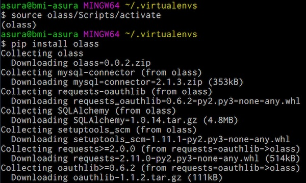

# Installation Steps - Windows

# Pre-requisites

Please see the details about what you need to prepare before proceeding with
the application installation at [docs/installation.md](docs/installation.md)

- download and install the latest python 3 release (python >= 3.4) from 
[Python Releases for Windows](https://www.python.org/downloads/windows/) page

Note: Make sure that you have the option **"Add Python to environment variables"**
checked when asked during installation.

Example of python installation url:
    [python-3.5.2-amd64.exe](https://www.python.org/ftp/python/3.5.2/python-3.5.2-amd64.exe)

- install [git-for-windows](https://git-for-windows.github.io/)

- start the "Git Bash" executable and verify that the latest version of the
**pip** utility is installed

        $ pip --version
        $ python -m pip install --upgrade pip

- create a folder for storing dependencies

        $ cd ~
        $ mkdir .virtualenvs

- install the helper tool for isolating the installation files

        $ pip install virtualenv

- activate the isolation environment

        $ virtualenv olass
        $ source olass/Scripts/activate

Note: Please verify that the prompt has changed and indicates **(olass)**
as an active python environment as in the image below:

- install the software

        $ pip install olass

- create a directory for storing configuration and log files

        $ mkdir -p ~/olass/logs

- create a config file by using the
[`settings_example.py`](https://github.com/ufbmi/olass-client/blob/master/config/settings_example.py)
file as a template

        $ cp settings_example.py ~/olass/settings.py

- edit the config file (add the proper values)

        $ vim ~/olass/settings.py

- display the OLASS version number then run it

        $ olass --version
        $ olass -c ~/olass/settings.py
